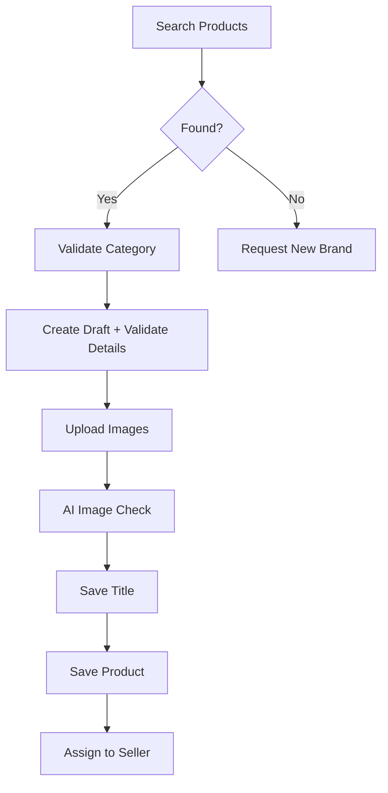

# Digikala Marketplace API Skill

A comprehensive skill for integrating with the **Digikala Marketplace Open API** (seller.digikala.com) — Iran's largest e-commerce platform's seller API with 274 endpoints.

## Overview

This skill enables seamless interaction with Digikala's seller API for:
- **Product Management** - Full product creation pipeline (search → validate → create → assign)
- **Category Navigation** - Tree browsing, keyword search, validation
- **Image Handling** - Upload to temp storage, AI quality checks
- **Order, Shipment, Finance, Customer Service** - Additional endpoints documented in references

## Installation

### Option 1: Clone to Local Skills Directory
```bash
git clone <this-repo> ~/.claude/skills/digikala
```

### Option 2: Copy from Workspace
```bash
cp -r /path/to/skills/digikala ~/.claude/skills/
```

### Option 3: Manual Install (Claude Code)
```bash
mkdir -p ~/.claude/skills/digikala
# Copy SKILL.md, scripts/, and references/ directories
```

## Quick Start

1. **Register a Client** with Digikala (contact `Marketplace-API@digikala.com`)
2. **Obtain Access Token** from Digikala seller panel or OAuth flow
3. **Provide Token** (choose one):
   ```bash
   # Option A: Environment variable
   export DIGIKALA_ACCESS_TOKEN="your_access_token_here"
   
   # Option B: Token file (recommended for persistence)
   mkdir -p ~/.digikala
   echo "your_access_token_here" > ~/.digikala/token
   chmod 600 ~/.digikala/token
   ```
4. **Start Using the API**:
   ```bash
   # Search products
   bash ~/.claude/skills/digikala/scripts/product-create.sh search "iPhone 15"
   
   # Browse categories
   bash ~/.claude/skills/digikala/scripts/category.sh tree
   ```

## Scripts Reference

### Product Creation (`product-create.sh`)
| Command | Description |
|---------|-------------|
| `search <keyword> [categories] [brands] [statuses]` | Search existing products |
| `suggest <keyword>` | Get product suggestions for selling |
| `be-seller <product_id>` | Check if can sell product, get commission rate |
| `search-category <keyword>` | Find categories by keyword |
| `validate-category <category_id>` | Validate category & get required attributes |
| `validate-detail <json>` | Validate product details |
| `draft-count` | Count draft products |
| `get-draft <id>` | Get draft product details |
| `auto-title <draft_id>` | Get AI-generated title suggestion |
| `save-title <draft_id> <title_fa> [title_en] [desc] [advantages] [disadvantages]` | Save/validate title |
| `get-attributes <category_id>` | Get category attributes |
| `validate-attributes <json>` | Validate product attributes |
| `save-product <json>` | Create/save product |
| `assign <product_id>` | Assign product to seller |
| `brand-request <json>` | Request new brand |

### Category (`category.sh`)
| Command | Description |
|---------|-------------|
| `tree [parent_id]` | Get category tree (root or children) |
| `search <keyword>` | Search categories by keyword |
| `validate <category_id>` | Validate category for product creation |

### Images (`image.sh`)
| Command | Description |
|---------|-------------|
| `upload-product <file>` | Upload product image to temp storage |
| `upload-request <file>` | Upload content request image |
| `upload-brand <file>` | Upload brand logo image |
| `ai-check <image_id> [is_main]` | AI quality check on uploaded image |

## Product Creation Workflow



### Example: Complete Product Creation
```bash
# 1. Search for existing product
bash product-create.sh search "ساعت هوشمند"

# 2. Check if can sell a specific product
bash product-create.sh be-seller 12345

# 3. Validate category (get required attributes)
bash product-create.sh validate-category 6351

# 4. Validate product details
bash product-create.sh validate-detail '{
  "category_id": 6351,
  "division_id": 123,
  "model": "Galaxy Watch 6",
  "brand_id": 456,
  "is_iranian": false
}'

# 5. Upload images
bash image.sh upload-product ./watch-main.jpg
bash image.sh upload-product ./watch-side.jpg

# 6. AI quality check
bash image.sh ai-check "img_abc123" true

# 7. Save title (Persian)
bash product-create.sh save-title 789 "ساعت هوشمند سامسونگ گلکسی واچ ۶"

# 8. Save product with images
bash product-create.sh save-product '{
  "category_id": 6351,
  "draft_product_id": 789,
  "use_temp_images": true,
  "only_b2b": false,
  "photos_detail": {
    "main_image": "img_abc123",
    "order": "img_abc123,img_def456",
    "images": [
      {"encrypted_id": "img_abc123", "active": true},
      {"encrypted_id": "img_def456", "active": true}
    ]
  }
}'

# 9. Assign to seller
bash product-create.sh assign 99999
```

## Token Management

**No token storage by scripts.** You manage tokens manually:

```bash
# Environment variable (per session)
export DIGIKALA_ACCESS_TOKEN="your_token"

# Persistent file (recommended)
mkdir -p ~/.digikala
echo "your_token" > ~/.digikala/token
chmod 600 ~/.digikala/token
```

- Scripts read token from `DIGIKALA_ACCESS_TOKEN` env var first, then `~/.digikala/token`
- **Never commit tokens to version control**
- Rotate tokens periodically via Digikala seller panel
- Tokens expire — renew before expiration

## API Reference

See [references/endpoints.md](references/endpoints.md) for the complete list of 274 endpoints organized by domain.

## Error Handling

| HTTP Code | Meaning | Action |
|-----------|---------|--------|
| 200 | Success | Process response |
| 400 | Validation Error | Check `errors` field in response |
| 401 | Unauthorized | Update `DIGIKALA_ACCESS_TOKEN` or `~/.digikala/token` |
| 403 | Forbidden | Check scopes via `/auth/scopes/{client_code}` |
| 404 | Not Found | Verify IDs |
| 429 | Rate Limited | Wait for `reset_time` header |
| 500 | Server Error | Retry, contact support if persistent |

## Sandbox Environment

For development without live credentials:
- **Repo**: https://github.com/salimousavi/seller_service_sandbox
- Provides mock data for all endpoints
- No client registration required

## Important Notes

- **Persian/Farsi Content**: Many fields use Persian (titles, descriptions, category names)
- **Client Registration Required**: Must have active client registered with Digikala
- **Scope-Based Access**: Each endpoint requires specific scope — check `/auth/scopes/{client_code}`
- **Temp Images Expire**: Use `use_temp_images: true` in product save to reference uploaded images
- **Commission Rates Vary**: Check `/product-creation/be-seller/{id}` before listing
- **Rate Limits Apply**: Respect `X-RateLimit-*` headers

## Support

- **API Documentation**: https://seller.digikala.com/open-api/docs
- **Email**: Marketplace-API@digikala.com
- **Issues**: Report via GitHub or contact support

## License

Internal skill for Digikala Marketplace API integration.